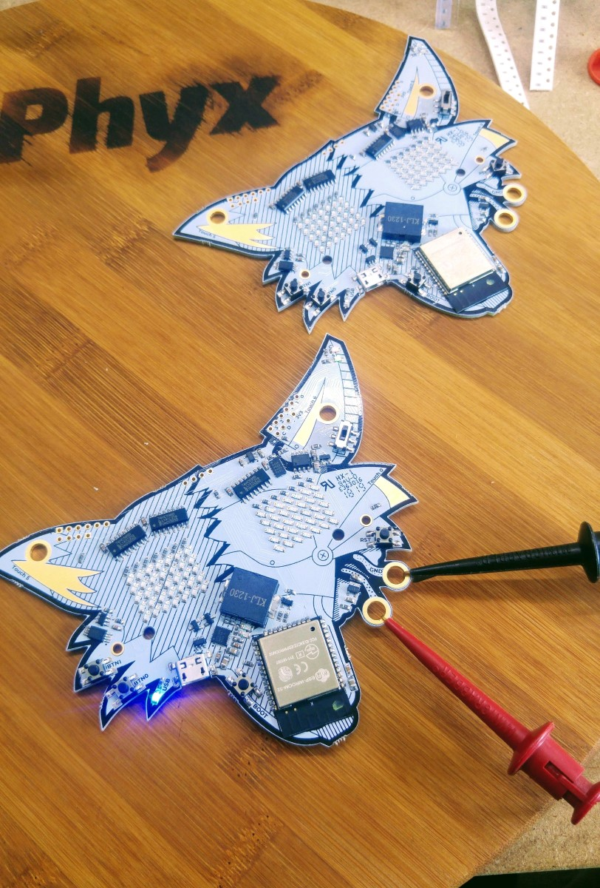

# Fri3d Badge 2018 - MicroPython Edition

As it became a common phenomenon, every hacker camp should have their own badge. This year, we went the extra mile when designing the badge for the 2018 edition of Fri3dcamp, resulting in an awesome badge with enormous capabilities.

Apart from the very neat design (nicely done @toonvandeputte), the badge has been built around the ESP32, a very powerful microcontroller holding 2 cores as well as wifi and bluetooth (among a lot of other stuff). But there is more! We added 2 LED matrices, a piezo speaker an accelerometer and captive touch sensors to satisfy a lot of your maker needs.

If you need more, you can have a look at the Jewels; plug-on extensions providing even more functionality to the badge. Or maybe you want to design your own Jewel?     
 
We are working hard to make the badge something that stands out, so make sure to get back once in a while to check on our progress. For now, most information can be found in the docs folder.
 
## The Badge

The badge contains the following hardware capabilities:

| component   | status    | description                              |
|-------------|-----------|------------------------------------------|
| Wifi        | working   | Connect to a wifi accesspoint or router. |
| Matrix      | working   | Two 5x7 LED matrices, representing eyes. |
| Accelero    | working   | Accelerometer measuring acceleration.    |
| Buzzer      | working   | A piezo speaker to make some noise.      |
| Touch       | partially | Captive touch sensors.                   |
| Buttons     | issues    | Regular push buttons.                    |

 
## Jewels
Jewels are plug-on extensions providing extra functionality to the badge. 

### Servo Jewel
The Servo Jewel provides the badge with the ability to control up to 4 servo's. It is uses in the Robot Kit to move the legs around, but can be used in any situation where up to 4 servos have to be controlled.

## Kits
Kits are units which transforms the badge into something totally new.

### Robot Kit
The robot kit transforms the badge into a bipedal robot capable of moving around.
 
## Issues
### Buttons
Buttons do not seem to react to input. The pin values do not change during presses or releases.

### Touch Sensors
touch sensor 0 does not seem to be responding.