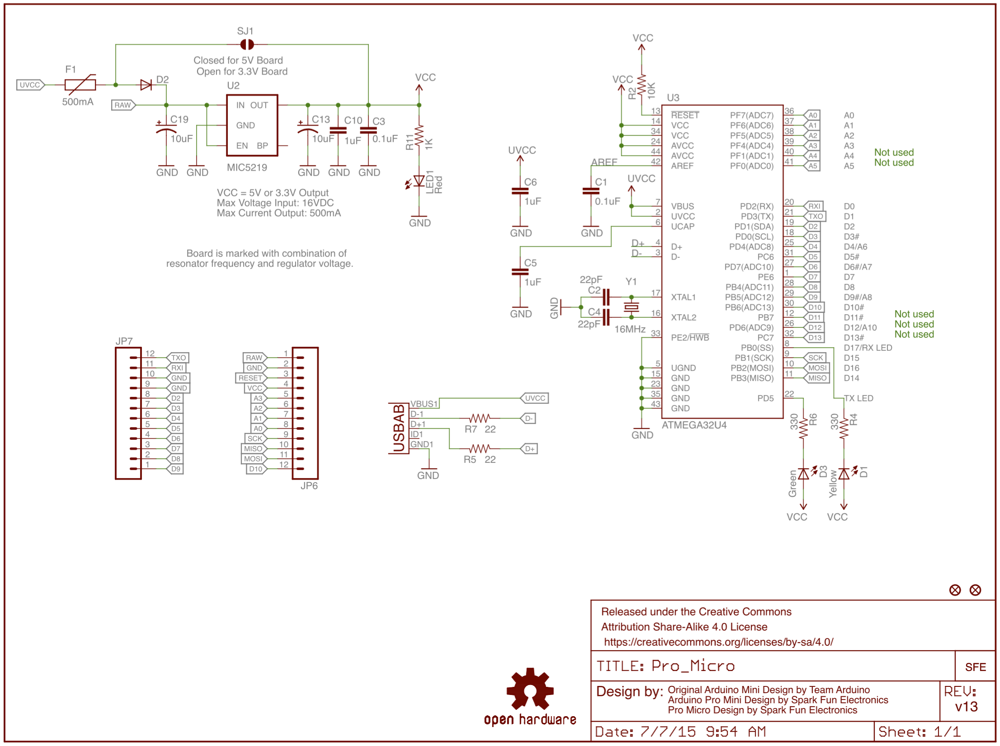
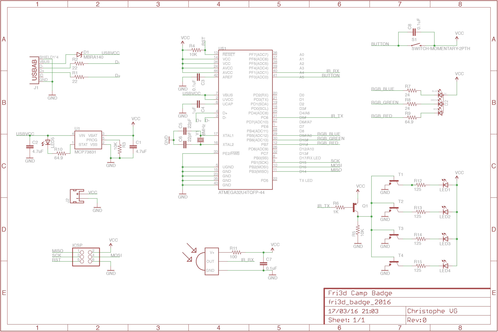

# Design Dagboek

Aangezien dit [mijn](http://christophe.vg) eerste SMD-gebaseerde ontwerp is, zal het een fijne leerschool worden. Daarom wil ik deze hier documenteren, voor mezelf, maar ook voor iemand anders die het ook wel eens van naderbij wil bekijken.

## Klaar? ... Start ... Leer!

Ik heb gekozen voor
[Eagle](http://www.cadsoftusa.com/eagle-pcb-design-software/about-eagle/), de de facto standaard editor voor PCB ontwerp. De [gratis versie](http://www.cadsoftusa.com/download-eagle/freeware/) biedt alle mogelijkheden, met beperkingen waar je niet snel tegen loopt als beginner. De software is tevens beschikbaar voor alle courante platformen (Windows, Linux, Max OS X), wat niet het geval is met de meeste concurrenten.

Software kiezen is één, er mee werken... Gelukkig zijn er zeer goeie tutorials online te vinden:

* [https://learn.sparkfun.com/tutorials/how-to-install-and-setup-eagle](https://learn.sparkfun.com/tutorials/how-to-install-and-setup-eagle)
* [https://learn.sparkfun.com/tutorials/using-eagle-schematic](https://learn.sparkfun.com/tutorials/using-eagle-schematic)
* [https://learn.sparkfun.com/tutorials/using-eagle-board-layout](https://learn.sparkfun.com/tutorials/using-eagle-board-layout)
* [https://learn.sparkfun.com/tutorials/designing-pcbs-advanced-smd](https://learn.sparkfun.com/tutorials/designing-pcbs-advanced-smd)

## De schouders van reuzen

Het wiel uitvinden is al lang niet meer nodig in het koninkrijk van electronica. Er zijn heel veel designs te vinden die allemaal een deel van de puzzel kunnen zijn. Zo ben ik ook vertrokken van enkele grote puzzelstukken en heb die bij elkaar gebracht.

### Arduino Micro Pro 3.3V

De basis van het ontwerp is de Arduino Micro Pro in de versie die op 3.3V werkt. Deze bevat alle minimale eisen die we stelden aan het ontwerp, in een redelijk eenvoudig samen te stellen geheel. De microcontroller, de ATMEGA32u4, bevat USB connectiviteit, waardoor eenvoudige ondersteuning voor de Arduino IDE en programmaring mogelijk wordt.

[https://www.sparkfun.com/products/12587](https://www.sparkfun.com/products/12587)

### TV B Gone

De initiële plannen om een draadloze netwerk-verbinding te incorporeren, strandden toen we de prijzen zagen voor de RF modules. Gelukkig bestaat er een "goedkoop" alternatief, die relatief dezelfde technologie introduceert, op een veel eenvoudigere en betaalbare manier: infra-rode (IR) stralen.

En als we aan IR denken, komen we al snel uit bij Mitch Altmans TV B Gone. Deze IR zendende oplossing kan prima dienen als referentie design voor deze functionaliteit.

[https://learn.adafruit.com/tv-b-gone-kit/download](https://learn.adafruit.com/tv-b-gone-kit/download) 

### LiPo oplaad circuit

De IR LEDs trekken al snel een stroom die boven de mogelijkheden liggen van een coin cell batterij. We konden gaan voor 2 AAA batterijen, maar dan wordt de badge al snel log en zwaar. Daarom proberen we bij het initiële design te vertrekken van een herlaadbare LiPo batterij.

Om deze te kunnen opladen, hebben we een integratie nodig met de inkomende USB voeding. Gelukkig bestaat ook daarvoor een bijna de facto oplossing en is ook het omringende oplaad-circuit mooi gedocumenteerd.

[https://learn.sparkfun.com/tutorials/lipo-usb-charger-hookup-guide](https://learn.sparkfun.com/tutorials/lipo-usb-charger-hookup-guide)

## Fri3d Badge Schema versie 1

De combinatie van de drie voorgaand vermelde referentie designs, gecombineerd met nog een knopje, RGB LED en IR ontvanger, levert ons ...

**Wordt vervolgd...**
